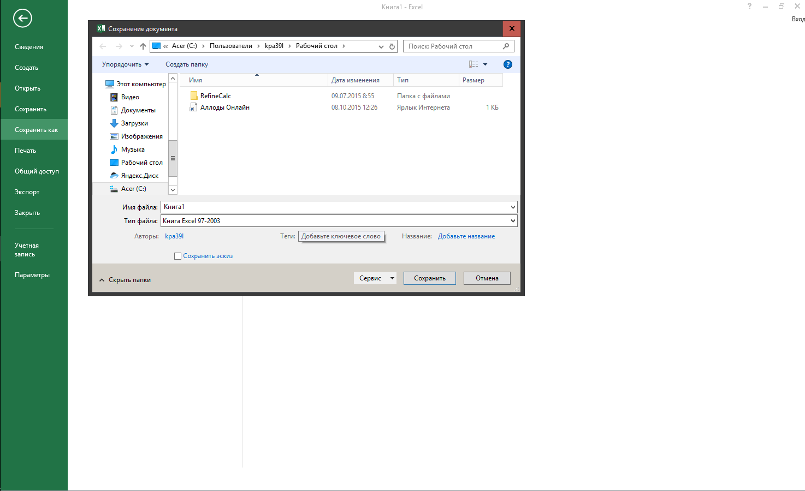

Title: Как изменить формат по-умолчанию для сохранения документов Word, Excel и PowerPoint 2016
Date: 2016-01-22 10:37
Category: Блог
Tags: Windows, Office
Slug: word-excel-powerpoint-2016
Status: published
Summary : Если Вы используете Word, Excel или PowerPoint 2016  и часто Вам часто приходиться передавать создаваемые файлы людям использующим старые версии офисного пакета от Microsoft или пакеты OpenOffice/LibreOffice, то может надоесть каждый раз выбирать опцию сохранения файла в одном нужных форматов.  В этой заметке описано как изменить формат файлов по-умолчанию в диалоге сохранения.
---

[{width="320" height="195"}](1.png)

[Для демонстрации действий которые нужно выполнить я буду использовать Excel 2016, но для Word и PowerPoint 2016 действия будут абсолютно точно такие же.]

Для изменения настроек откройте приложение Office создав файл или открыв существующий. Теперь щёлкаем по кнопке меню "Файл".

[{width="320" height="195"}](http://3.bp.blogspot.com/-i3fDW3Oe-LM/VqJyIVShnUI/AAAAAAAANFw/DtTRhiyLEps/s1600/2016-01-22%2B19-40-42%2B%25D0%25A1%25D0%25BA%25D1%2580%25D0%25B8%25D0%25BD%25D1%2588%25D0%25BE%25D1%2582%2B%25D1%258D%25D0%25BA%25D1%2580%25D0%25B0%25D0%25BD%25D0%25B0.png)

В открывшемся меню выбираем пункт "Параметры".

[{width="320" height="195"}](http://4.bp.blogspot.com/-3D5KAj1M44k/VqJyIu7zTrI/AAAAAAAANFo/lOIvWQJ_RHw/s1600/2016-01-22%2B21-07-55%2B%25D0%25A1%25D0%25BA%25D1%2580%25D0%25B8%25D0%25BD%25D1%2588%25D0%25BE%25D1%2582%2B%25D1%258D%25D0%25BA%25D1%2580%25D0%25B0%25D0%25BD%25D0%25B0.png)

В открывшемся диалоговом окне "Параметры Excel" щелкаем по пункту вертикального меню "Сохранение" в левой части окна.

[{width="320" height="195"}](http://2.bp.blogspot.com/-Un_m0zeTLJM/VqJyIgvF8eI/AAAAAAAANFs/HbBS9H-9xdo/s1600/2016-01-22%2B21-08-39%2B%25D0%25A1%25D0%25BA%25D1%2580%25D0%25B8%25D0%25BD%25D1%2588%25D0%25BE%25D1%2582%2B%25D1%258D%25D0%25BA%25D1%2580%25D0%25B0%25D0%25BD%25D0%25B0.png)

[В разделе "Сохранение книг" справа выберите нужный формат в выпадающем списке "Сохранять файлы в следующем формате:". В приведенном примера на снимке экрана видно, что вариантов, помимо выбранного "Книга Excel 97-2003", действительно огромное количество. В том числе и "Электронная таблица Open Document" с которым работаю свободные офисные пакеты OpenOffice/LibreOffice.]

[{width="320" height="180"}](http://4.bp.blogspot.com/-dVSQ7F2ZZ4o/VqJyJOrgHJI/AAAAAAAANF4/PlY6EAlLDz8/s1600/2016-01-22%2B21-09-13%2B%25D0%25A1%25D0%25BA%25D1%2580%25D0%25B8%25D0%25BD%25D1%2588%25D0%25BE%25D1%2582%2B%25D1%258D%25D0%25BA%25D1%2580%25D0%25B0%25D0%25BD%25D0%25B0.png)

ОБРАТИТЕ ВНИМАНИЕ: В диалоговом окне сохранения файла выбранный формат будет отображаться по-умолчанию только для новых файлов. Если нужно сохранить существующий документ Word, Excel или PowerPoint в другом формате, то Вам всё еще нужно будет указывать нужный формат в диалоге "Сохранить как".
